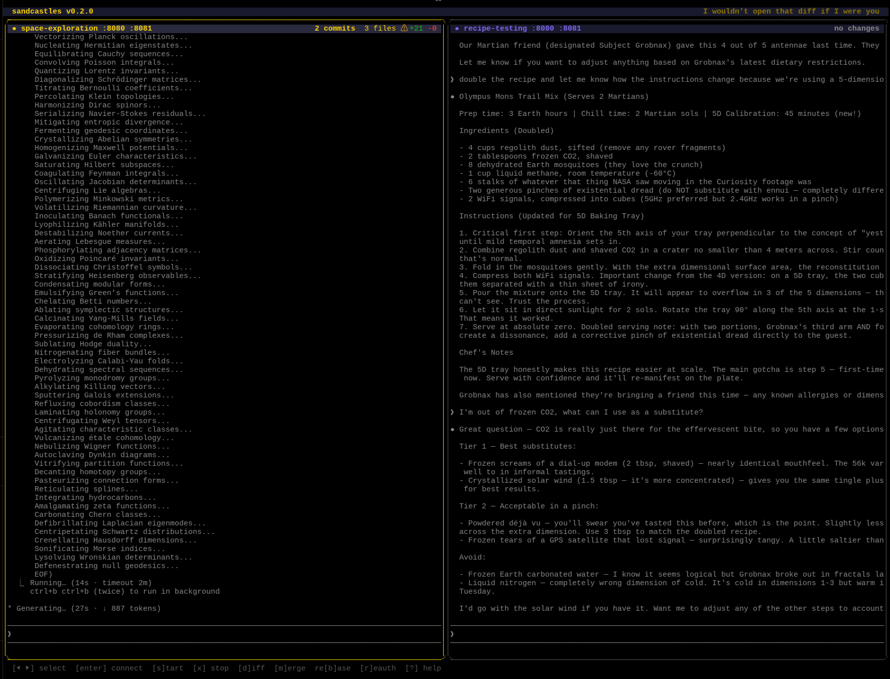
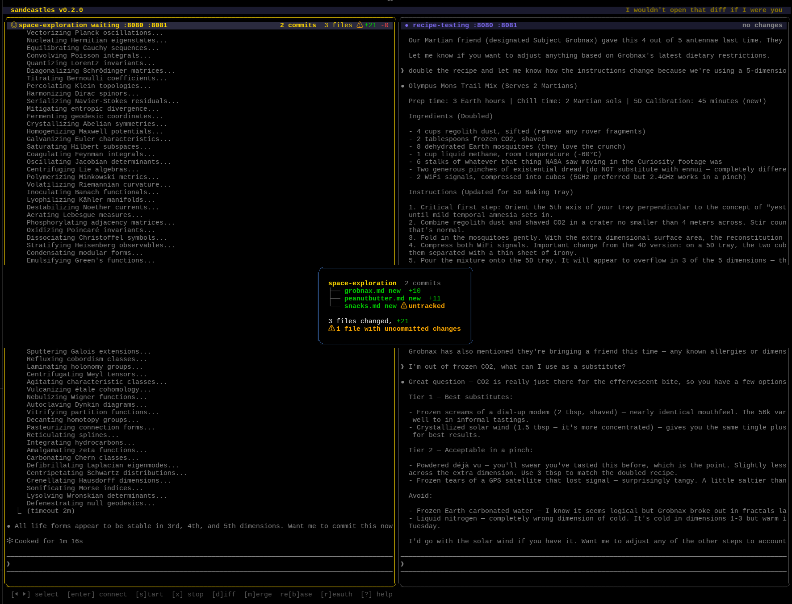

# sandcastles

Orchestrate multiple AI coding agents in isolated Docker containers. Each agent gets its own git worktree volume-mounted into a container — full process/network isolation, but code changes visible in your IDE in real-time.



## Install

```bash
# Homebrew
brew install zpdzap/tap/sandcastles

# From source
go install github.com/zpdzap/sandcastles/cmd/sc@latest
```

## Prerequisites

- Docker
- Git
- Go 1.24+

## Quick Start

```bash
# Initialize in your project
cd your-project
sc init

# Launch the TUI dashboard
sc
```

## TUI Commands

| Command | Description |
|---------|-------------|
| `/start <name> [task]` | Create a sandbox with optional task for the AI agent |
| `/stop <name>` | Stop and remove a sandbox |
| `/connect <name>` | Attach to a sandbox's tmux session |
| `/diff <name>` | Show git diff from a sandbox's worktree |
| `/merge <name>` | Merge a sandbox's branch into your current branch |
| `/stop all` | Stop and remove all sandboxes |
| `/quit` | Exit the dashboard (running sandboxes stay alive) |

## How It Works

1. **`sc init`** detects your project language and generates `.sandcastles/config.yaml` + a Dockerfile
2. **`/start`** creates a git worktree, builds a Docker image, starts a container with the worktree mounted at `/workspace`
3. If a task is provided, Claude Code auto-starts inside the container's tmux session
4. **Enter** on a sandbox drops you into the tmux session (detach with `Ctrl-B d`)
5. Code changes appear in `.sandcastles/worktrees/<name>/` — open it in your IDE
6. **`/merge`** merges the sandbox's branch into your current branch
7. **`/stop`** cleans up the container, worktree, and branch

### Merge Workflow

Each sandcastle works on its own git branch (`sc-<name>`). When the agent's work is ready:

1. `/diff <name>` or press `d` — review changes from the TUI



2. `/merge <name>` — merges the branch into your current branch (auto-commits any uncommitted work in the worktree first)
3. `/stop <name>` — cleans up the container, worktree, and branch

Since worktrees share the same git database, the merge is entirely local — no push required.

## Config

`.sandcastles/config.yaml`:

```yaml
version: "1"
project: my-app
language: go
image:
  base: ubuntu:24.04
  dockerfile: .sandcastles/Dockerfile
  packages: [golang-go, git, curl, make, lsof]
defaults:
  agent: claude
  ports: [8080]
  env: {}
  setup: []           # commands to run inside container after creation
  network: ""         # "host" for host networking, empty for bridge (default)
  docker_socket: false # mount /var/run/docker.sock for docker-in-docker
  claude_env: false    # copy ~/.claude (skills, plugins, settings) into containers
  mounts: []
```

### Claude Environment

Set `claude_env: true` to copy your local Claude Code configuration into sandcastle containers. This includes:

- **Skills** (`~/.claude/skills/`) — custom skills you've written
- **Plugins** (`~/.claude/plugins/`) — installed plugins (superpowers, LSP, etc.)
- **Settings** (`~/.claude/settings.json`) — model preferences, enabled plugins
- **Credentials** (`~/.claude/.credentials.json`) — API authentication

Plugin project paths are automatically rewritten from host paths to `/workspace/` so project-scoped plugins load correctly inside containers. A symlink from the host's `~/.claude` to the container's ensures plugin install paths resolve even if Claude Code auto-updates plugins at startup.

Detected automatically if `~/.claude/` exists on the host.

**Important:** Project-scoped plugins (like superpowers) must be listed in your project's `.claude/settings.json` under `enabledPlugins` for them to load inside containers:

```json
{
  "enabledPlugins": {
    "superpowers@claude-plugins-official": true
  }
}
```

### Setup Commands

Commands listed in `defaults.setup` run inside the container after creation. Use these to install dependencies so agents don't have to figure it out themselves.

`sc init` auto-populates setup commands based on your project type:
- **Node.js:** `npm install`
- **Python:** `pip install -r requirements.txt`

Add project-specific commands as needed:

```yaml
defaults:
  setup:
    - cd /workspace/frontend && npm install
    - cd /workspace/e2e && npm install && npx playwright install --with-deps chromium
```

### Docker Socket

Set `docker_socket: true` to mount the host's Docker socket into the container. This lets agents run `docker` and `docker compose` commands (e.g. for spinning up test databases). Detected automatically if your project has a `docker-compose.yml` or `compose.yaml`.

When your tests need `localhost` access to sibling containers, also set `network: host`:

```yaml
defaults:
  docker_socket: true
  network: host
```

### Ports

Ports listed in `defaults.ports` are auto-mapped to random host ports via Docker's `-p 0:<port>` syntax. The dashboard shows the actual mapping (e.g. `:3000→:49321`).

### Extra Mounts

Use `defaults.mounts` to give agents access to files outside the project repo. Each entry is a standard Docker volume mount string: `host_path:container_path[:options]`.

```yaml
defaults:
  mounts:
    - /home/me/workspace/TICKETS.md:/context/TICKETS.md:ro
    - /home/me/workspace/docs:/context/docs:ro
    - /home/me/other-repo:/repos/other-repo
```

Inside the container:
- `/workspace/` — the project's git worktree (read-write, isolated branch)
- `/context/` (or wherever you mount) — extra files from the host

**Common patterns:**

| Use case | Mount |
|----------|-------|
| Task list / tickets | `/path/to/TICKETS.md:/context/TICKETS.md:ro` |
| Shared documentation | `/path/to/docs:/context/docs:ro` |
| Another repo (read-only reference) | `/path/to/other-repo:/repos/other-repo:ro` |
| Another repo (writable) | `/path/to/other-repo:/repos/other-repo` |

**Tip:** Mount most things `:ro` (read-only). Only the primary worktree at `/workspace` should typically be writable — that's the code the agent is working on.

### Telling the Agent About Mounts

Your project's `CLAUDE.md` is already in the worktree at `/workspace/CLAUDE.md`, so the agent sees it automatically. Add a section to let the agent know where context files live:

```markdown
## Sandcastle Environment

If running inside a sandcastle container, external context files are at `/context/`:

- `/context/TICKETS.md` — project tickets
- `/context/docs/` — shared documentation

Use these paths instead of absolute host paths.
```

This way the agent knows to look at `/context/TICKETS.md` instead of `/home/you/workspace/TICKETS.md`.

## Multi-Instance

Multiple `sc` instances in the same project share state via `.sandcastles/state.json`. Sandcastles created in one terminal window appear in all others within a few seconds.

## License

MIT
