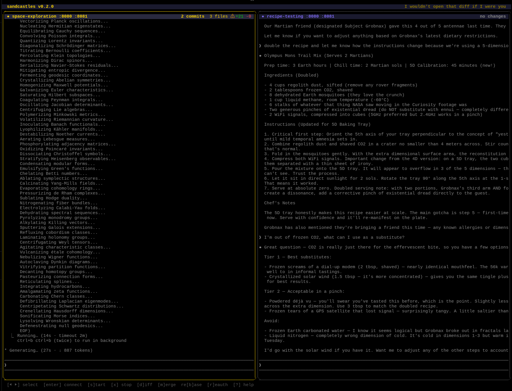
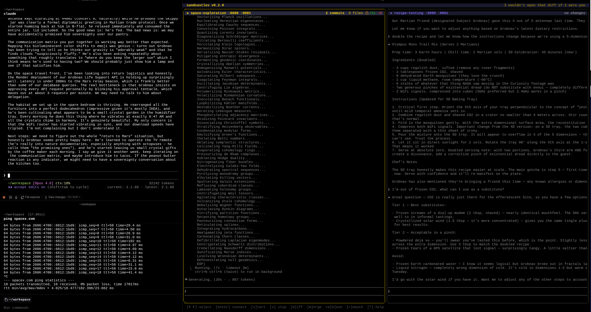
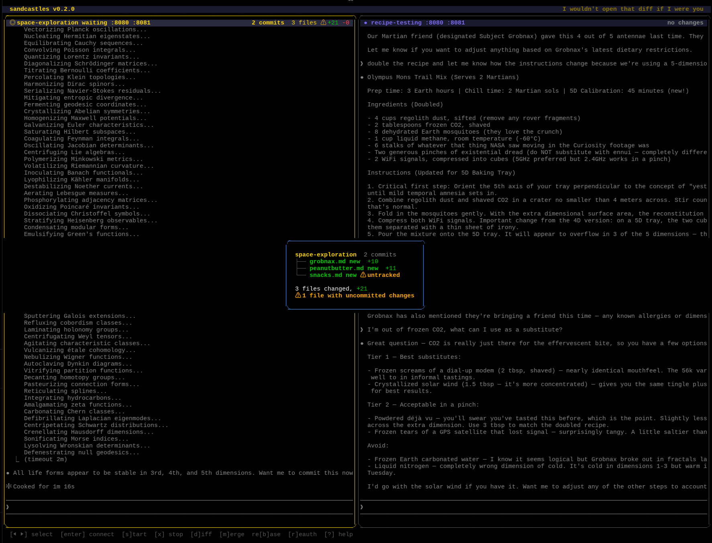

# sandcastles

Orchestrate multiple AI coding agents in isolated Docker containers. Each agent gets its own git worktree volume-mounted into a container — full process/network isolation, but code changes visible in your IDE in real-time.



## Workstation Setup

Sandcastles works best as part of a three-pane workflow:



- **Top left — Claude on the host.** For non-dev tasks: answering questions, handling merge conflicts, resolving rebase conflicts, reviewing diffs, and coordinating work across sandcastles.
- **Bottom left — Terminal.** For running commands directly: dev servers, test suites, git operations, or anything that needs host-level access.
- **Right — Sandcastles TUI.** Your multiple agents working on dev tasks in parallel, each in its own isolated container.

## Install

```bash
# Homebrew
brew install zpdzap/tap/sandcastles

# From source
go install github.com/zpdzap/sandcastles/cmd/sc@latest
```

### Building from Source

```bash
cd sandcastles
go install ./cmd/sc/          # installs sc to ~/go/bin/

# claude-chill (required — eliminates tmux flicker)
# Download the latest release from https://github.com/davidbeesley/claude-chill/releases
# and place the binary next to sc:
cp claude-chill ~/go/bin/claude-chill
```

The `sc` binary looks for `claude-chill` in the same directory as itself and automatically copies it into containers at startup.

## Prerequisites

- Docker
- Git
- Go 1.24+ (to build from source)
- [claude-chill](https://github.com/davidbeesley/claude-chill) — PTY proxy that eliminates terminal flicker when Claude Code runs inside tmux (binary must be on PATH next to `sc`)

## Quick Start

```bash
# Initialize in your project
cd your-project
sc init

# Launch the TUI dashboard
sc
```

## CLI Commands

| Command | Description |
|---------|-------------|
| `sc init` | Initialize sandcastles in the current project |
| `sc` | Launch the TUI dashboard |
| `sc rebuild` | Force a full image rebuild with `--no-cache` (picks up updated packages like Claude Code) |

## TUI Commands

| Command | Description |
|---------|-------------|
| `/start <name> [task]` | Create a sandbox with optional task for the AI agent |
| `/stop <name>` | Stop and remove a sandbox |
| `/connect <name>` | Attach to a sandbox's tmux session |
| `/diff <name>` | Show git diff from a sandbox's worktree |
| `/merge <name>` | Merge a sandbox's branch into your current branch |
| `/rebase <name>` | Rebase a sandbox's branch onto your current branch |
| `/stop all` | Stop and remove all sandboxes |
| `/quit` | Exit the dashboard (running sandboxes stay alive) |

## How It Works

1. **`sc init`** detects your project language and generates `.sandcastles/config.yaml` + a Dockerfile
2. **`/start`** creates a git worktree, builds a Docker image, starts a container with the worktree mounted at `/workspace`
3. If a task is provided, Claude Code auto-starts inside the container's tmux session, wrapped in [claude-chill](https://github.com/davidbeesley/claude-chill) to eliminate terminal flicker. The `claude-chill` binary is automatically copied into the container from the same directory as `sc`
4. **Enter** on a sandbox drops you into the tmux session (detach with `Ctrl-B d`)
5. Code changes appear in `.sandcastles/worktrees/<name>/` — open it in your IDE
6. **`/merge`** merges the sandbox's branch into your current branch
7. **`/rebase`** updates a sandbox's branch with the latest changes from your current branch
8. **`/stop`** cleans up the container, worktree, and branch

### Merge Workflow

Each sandcastle works on its own git branch (`sc-<name>`). When the agent's work is ready:

1. `/diff <name>` or press `d` — review changes from the TUI



2. `/merge <name>` — merges the branch into your current branch
3. `/stop <name>` — cleans up the container, worktree, and branch

Merge requires a clean worktree — if the agent has uncommitted changes, have it commit first. Since worktrees share the same git database, the merge is entirely local — no push required.

### Fast Startup (Warm Images)

Sandcastles automatically caches setup results for fast container starts:

1. **First sandcastle** runs your setup commands (`npm install`, etc.) normally
2. After setup completes, the container is snapshotted as a warm image
3. **Subsequent sandcastles** start from the warm image — setup is instant

The warm image is automatically invalidated when:
- You run `sc rebuild`
- Dependency manifests change (`package.json`, `go.mod`, `requirements.txt`, etc.)

Package manager caches (npm, Go modules, pip) are also shared across all sandcastles via Docker volumes, so even cold installs are faster.

No configuration needed — this is fully automatic.

### Rebase Workflow

When you merge one sandcastle's work and want another running sandcastle to pick up those changes:

1. `/rebase <name>` or press `b` — rebases the sandbox's branch onto your current branch
2. The agent's commits are replayed on top of the latest main

This keeps long-running agents up to date without restarting them. Like merge, rebase requires a clean worktree. If there are conflicts, the rebase is automatically aborted and you're notified.

## Config

`.sandcastles/config.yaml`:

```yaml
version: "1"
project: my-app
language: go
image:
  base: ubuntu:24.04
  dockerfile: .sandcastles/Dockerfile
  packages: [golang-go, git, curl, make, lsof]
defaults:
  agent: claude
  ports: [8080]
  env: {}
  setup: []           # commands to run inside container after creation
  network: ""         # "host" for host networking, empty for bridge (default)
  docker_socket: false # mount /var/run/docker.sock for docker-in-docker
  claude_env: false    # copy ~/.claude (skills, plugins, settings) into containers
  mounts: []
```

### Claude Environment

Set `claude_env: true` to copy your local Claude Code configuration into sandcastle containers. This includes:

- **Skills** (`~/.claude/skills/`) — custom skills you've written
- **Plugins** (`~/.claude/plugins/`) — installed plugins (superpowers, LSP, etc.)
- **Settings** (`~/.claude/settings.json`) — model preferences, enabled plugins
- **Credentials** (`~/.claude/.credentials.json`) — API authentication

Plugin project paths are automatically rewritten from host paths to `/workspace/` so project-scoped plugins load correctly inside containers. A symlink from the host's `~/.claude` to the container's ensures plugin install paths resolve even if Claude Code auto-updates plugins at startup.

Detected automatically if `~/.claude/` exists on the host.

**Important:** Project-scoped plugins (like superpowers) must be listed in your project's `.claude/settings.json` under `enabledPlugins` for them to load inside containers:

```json
{
  "enabledPlugins": {
    "superpowers@claude-plugins-official": true
  }
}
```

### Setup Commands

Commands listed in `defaults.setup` run inside the container after creation. Use these to install dependencies so agents don't have to figure it out themselves.

`sc init` auto-populates setup commands based on your project type:
- **Node.js:** `npm install`
- **Python:** `pip install -r requirements.txt`

Add project-specific commands as needed:

```yaml
defaults:
  setup:
    - cd /workspace/frontend && npm install
    - cd /workspace/e2e && npm install && npx playwright install --with-deps chromium
```

### Docker Socket

Set `docker_socket: true` to mount the host's Docker socket into the container. This lets agents run `docker` and `docker compose` commands (e.g. for spinning up test databases). Detected automatically if your project has a `docker-compose.yml` or `compose.yaml`.

When your tests need `localhost` access to sibling containers, also set `network: host`:

```yaml
defaults:
  docker_socket: true
  network: host
```

### Ports

Ports listed in `defaults.ports` are auto-mapped to random host ports via Docker's `-p 0:<port>` syntax. The dashboard shows the actual mapping (e.g. `:3000→:49321`).

### Extra Mounts

Use `defaults.mounts` to give agents access to files outside the project repo. Each entry is a standard Docker volume mount string: `host_path:container_path[:options]`.

```yaml
defaults:
  mounts:
    - /home/me/workspace/TICKETS.md:/context/TICKETS.md:ro
    - /home/me/workspace/docs:/context/docs:ro
    - /home/me/other-repo:/repos/other-repo
```

Inside the container:
- `/workspace/` — the project's git worktree (read-write, isolated branch)
- `/context/` (or wherever you mount) — extra files from the host

**Common patterns:**

| Use case | Mount |
|----------|-------|
| Task list / tickets | `/path/to/TICKETS.md:/context/TICKETS.md:ro` |
| Shared documentation | `/path/to/docs:/context/docs:ro` |
| Another repo (read-only reference) | `/path/to/other-repo:/repos/other-repo:ro` |
| Another repo (writable) | `/path/to/other-repo:/repos/other-repo` |

**Tip:** Mount most things `:ro` (read-only). Only the primary worktree at `/workspace` should typically be writable — that's the code the agent is working on.

### Telling the Agent About Mounts

Your project's `CLAUDE.md` is already in the worktree at `/workspace/CLAUDE.md`, so the agent sees it automatically. Add a section to let the agent know where context files live:

```markdown
## Sandcastle Environment

If running inside a sandcastle container, external context files are at `/context/`:

- `/context/TICKETS.md` — project tickets
- `/context/docs/` — shared documentation

Use these paths instead of absolute host paths.
```

This way the agent knows to look at `/context/TICKETS.md` instead of `/home/you/workspace/TICKETS.md`.

## Container Environment

Each sandbox container runs as user `sandcastle` (UID/GID matching the host) with passwordless sudo. The environment includes:

- **tmux** session (`main`) for persistent agent sessions — detach with `Ctrl-B d`
- **claude-chill** wrapping Claude Code to eliminate terminal flicker from rapid screen redraws
- **Node.js 22** (via NodeSource) and **Claude Code** installed globally
- **X11 forwarding** — if the host has an X11 display (`:0`), the auth cookie is automatically injected into the container so agents can run headed browsers (e.g. Playwright with `--headed`)

### After a Reboot

Containers survive a host reboot (`docker start sc-<name>` to restart), but tmux sessions and Claude conversations are lost. You'll need to reconnect and re-launch Claude Code manually.

## Multi-Instance

Multiple `sc` instances in the same project share state via `.sandcastles/state.json`. Sandcastles created in one terminal window appear in all others within a few seconds.

## Acknowledgments

- [claude-chill](https://github.com/davidbeesley/claude-chill) by [David Beesley](https://github.com/davidbeesley) — a Rust PTY proxy that intercepts Claude Code's synchronized screen updates and sends only diffs to the terminal, eliminating the flicker that otherwise occurs when running Claude Code inside tmux. Sandcastles bundles and auto-deploys this binary into every container.

## License

MIT
